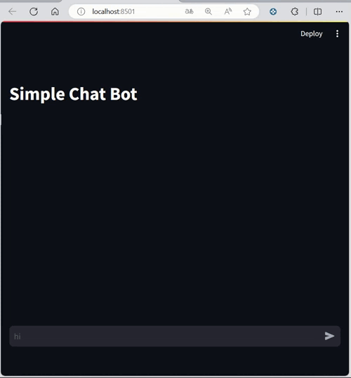

# Simple Chat Bot


This project entails the development of a chatbot leveraging the capabilities of OpenAI and Azure. The implementation integrates Langchain, OpenAI, and Streamlit libraries to facilitate its functionality.

## Table of Contents

1. [Installation](#installation)
2. [Usage](#usage)
3. [Contributing](#contributing)
4. [Project Structure](#project-structure)
5. [License](#license)
6. [Contact](#contact)

## Installation

<!--
To get started with the Awesome Python Project, follow these steps:

1. Clone the repository:

    ```bash
    git clone https://github.com/yourusername/awesome-python-project.git
    ```

2. Navigate to the project directory:

    ```bash
    cd awesome-python-project
    ```

3. Install the required dependencies:

    ```bash
    pip install -r requirements.txt
    ```
-->

## Usage




<!--
```python
# Example code using Awesome Python Project
from awesome_project import helper_function

# Call the helper function
result = helper_function("Hello, Awesome World!")
print(result)
-->


## License
This project is licensed under the MIT License. See the LICENSE.md file for details.

# Contact
If you have any questions or suggestions, feel free to contact me:

Email: oscar.ismael.frausto.perez@gmail.com